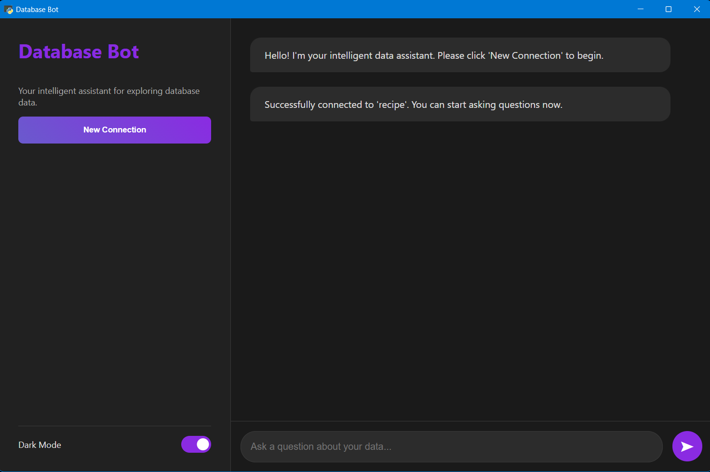
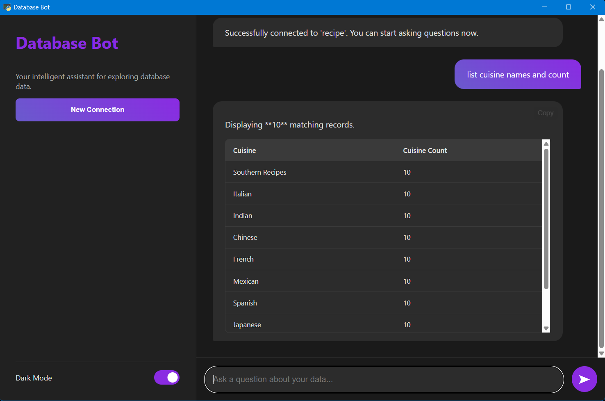

## 🧠 DatabaseBot — AI-Powered Intelligent Database Assistant

### 🚀 Overview

**DatabaseBot** is a smart, interactive **desktop-style Python application** that allows users to connect to any SQL database and query it through **natural language** — no SQL expertise required.
It automatically interprets your question, converts it into SQL, executes the query, and presents the results clearly within the app window.

Originally developed during my **AI internship (August 2025)**, this project was later **refined into a full desktop-style app (October 2025)** — run locally via Python to explore **AI-assisted database automation** and **human–AI hybrid design**.

---

### 💡 Core Features

* 💬 **Natural Language Querying** – Ask in English, get real SQL-based results instantly.
* 🤠 **AI-Generated SQL** – Converts complex intent into optimized, executable SQL.
* ⚙️ **Live Database Connection** – Supports **MySQL**, **PostgreSQL**, and **SQLite**.
* 🪄 **Conversational Context** – Remembers session history for follow-up queries.
* 💻 **Desktop-Style App** – Built using **Flask + PyWebView**, launched directly via Python (`python main.py`).
* 🤖 **AI-Assisted Development** – Created through an **AI-assisted workflow** to accelerate logic design and error handling — while maintaining full manual control over structure and model integration.

---

### 🤪 Tech Stack

| Layer                | Tools / Technologies              |
| -------------------- | --------------------------------- |
| **Frontend**         | PyWebView, HTML, CSS              |
| **Backend**          | Flask, SQLAlchemy, Flask-Session  |
| **AI Engine**        | Cohere Command-R                  |
| **Database Support** | MySQL, PostgreSQL, SQLite         |
| **Execution**        | Python (run via `python main.py`) |

---

### ⚙️ How It Works

1. **Launch the App** – Run `python main.py`.
   The application window will automatically open.
2. **Connect Your Database** – Provide host, username, password, and DB name.
3. **Ask a Question** – Examples:

   * “Show top 10 customers by purchase amount.”
   * “What’s the average salary by department?”
4. **View Instant Results** – AI generates the SQL, executes it, and returns formatted data.

---

### 🗂️ Project Structure

```
databasebot app/
│
├── main.py              # Launches app interface (PyWebView + Flask)
├── server.py            # Flask backend with AI integration
├── templates/           # Frontend HTML files
├── static/              # CSS, JS, icons
├── assets/              # Logos, resources
├── requirements.txt     # Dependencies
├── .env                 # Environment variables (Cohere API key)
└── venv/                # Virtual environment (excluded)
```

---

### 🤪 Demo Screenshots

#### 🖼️ Database Connection Successful



#### 🖼️ Query Asked and Answered



---

### ⚙️ Installation (Developer Mode)

```bash
# 1️⃣ Create virtual environment
python -m venv venv
venv\Scripts\activate

# 2️⃣ Install dependencies
pip install -r requirements.txt

# 3️⃣ Run the app locally
python main.py
```

✅ The desktop-style window will open automatically, running the full DatabaseBot interface.

To optionally package it as `.exe` later:

```bash
pyinstaller --onefile --noconsole --icon=assets/icon.ico main.py --name "DatabaseBot"
```

---

### 🔒 Limitations & Notes

* ✅ Handles **moderate and structured queries efficiently**.
* ⚙️ **Highly complex analytical or multi-join queries** may require **larger local LLMs** (e.g., GPT4All / Mistral) for deeper reasoning.
* 💻 These **advanced models demand high-end hardware (GPU / 16GB+ RAM)** — similar to running full-scale AI GUI tools.
* ⚡ Current setup is optimized for lightweight, general-purpose database operations on mid-range systems.

---

### 🤪 Author

**Kiruthika T**
🎓 *B.Tech in Artificial Intelligence and Data Science — Anna University*
🽕️ Developed: **August 2025 (Internship)** → Refined: **October 2025**
🌐 Focus: *AI-driven database querying & intelligent data automation*

---

### 🌟 Developer Note

> This project was built using an **AI-assisted workflow** to accelerate logic design, testing, and debugging — while retaining **manual control** over architecture and integration.
> It demonstrates a balanced synergy of **human problem-solving** and **AI precision** in software design.

---

